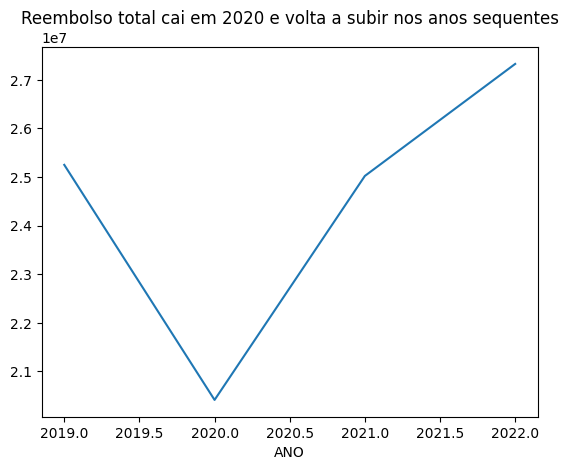
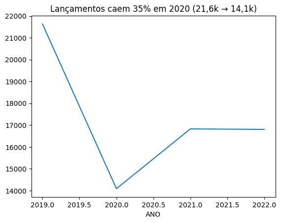
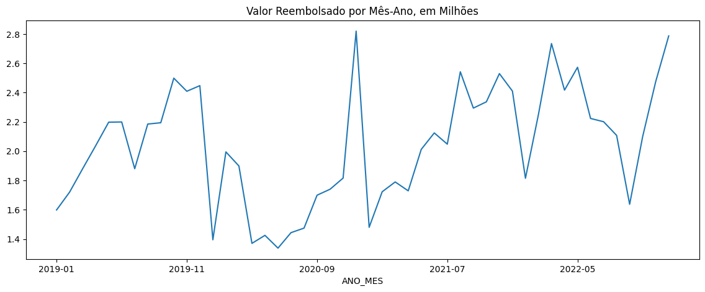

# Cota Parlamentar do Senado (CEAPS) — Análise Exploratória

> Como os senadores usam o reembolso da cota parlamentar entre 2019 e 2022, a partir dos dados abertos do Senado Federal.

## Status

Projeto em andamento, publicado em etapas:

- [x] EDA — distribuição por tipo/fornecedor, evolução temporal, qualidade de dado
- [ ] Estatística descritiva — média vs mediana, percentis
- [ ] Inferência — teste de hipótese entre tipos de despesa
- [ ] Sazonalidade multi-anos
      
## Pergunta de negócio

Como estão distribuídos os gastos do reembolso da cota parlamentar (CEAPS) — por tipo de despesa, por fornecedor e ao longo do tempo — e o que isso revela sobre a composição e a qualidade desse dado público.

## Dataset

- **Fonte:** Senado Federal — Portal da Transparência / LAI (`despesa_ceaps_<ano>.csv`).
- **Período analisado:** 2019–2022 (série pública disponível: 2008–2022).
- **Volume:** 69.356 lançamentos no período; 16.805 só em 2022.
- **Granularidade:** cada linha é um lançamento de reembolso (senador, tipo de despesa, fornecedor, data, valor).
- **Leitura:** CSV `sep=';'`, `encoding='latin-1'`, `skiprows=1`, `decimal=','`.

## Principais achados

**1. A cota é, na prática, um orçamento de deslocamento.**
Em 2022, passagens aéreas (27%) e locomoção/hospedagem (19%) somam ~46% dos R\$ 27,3 mi reembolsados. Nenhuma outra categoria chega perto.

**2. O gasto se concentra em poucos fornecedores de viagem.**
Uma única agência (Adria Viagens) recebeu R\$ 2,4 mi em 2022 — 8,9% de todo o reembolso do ano — em 1.224 lançamentos. Somada a LATAM e GOL, o setor aéreo lidera de longe.

**3. 2020 quebrou o padrão, mas só na viagem.**
Os lançamentos caíram 35% (21,6 mil → 14,1 mil) e o gasto com passagens despencou. A fatia do aluguel subiu de 16% para 19% e a de consultorias de 23% para 30% — não porque gastaram mais nelas, mas porque o total encolheu.

**4. O topo de gasto por senador é homogêneo.**
Os 10 senadores que mais gastam por mês ativo ficam entre R\$ 38,8 mil e R\$ 42,6 mil/mês, todos com atividade nos 12 meses de 2022.

**5. Há documentos datados muito fora do exercício.**
Os lançamentos carregam datas de 2000 a 2023 — muito além dos anos de exercício (2019–2022). Isso aponta para reembolso retroativo, restos a pagar ou erro de lançamento, e é o tipo de inconsistência que precisa ser tratada antes de qualquer análise de valor.

## Decisão técnica

O gasto por senador é normalizado **por mês ativo, não por total bruto**. Comparar totais entre mandatos de durações diferentes distorce o ranking; dividir pelo número de meses com atividade torna a comparação justa. Em 2022 todos os senadores do topo tiveram os 12 meses ativos, mas a normalização passa a importar no recorte multi-anos, onde há entrada e saída de mandato.

A limpeza de fornecedores também consolida grafias distintas do mesmo nome (ex.: variações de "Uber" e "Adria") antes de qualquer agregação por fornecedor — sem isso, a concentração de gasto fica subestimada.

## Stack

Python · pandas · numpy · matplotlib · Jupyter / Google Colab

## Como reproduzir

O notebook carrega os dados direto da URL do Senado, sem download manual.

- **Colab:** abrir `projeto1_ceaps.ipynb` → Ambiente de execução → Executar tudo.
- **Local:** `pip install pandas numpy matplotlib` e rodar o notebook (Restart & Run All).

## Evolução do projeto

Este repositório é publicado em versões, commit a commit, em vez de uma entrega única:

- **v1 — EDA** (atual): carga, limpeza, distribuição por tipo/fornecedor, evolução temporal e qualidade de dado.
- **Próximo — estatística descritiva:** média vs mediana do gasto por lançamento (distribuição assimétrica), percentis.
- **Próximo — inferência:** teste de hipótese entre tipos de despesa.
- **Próximo — sazonalidade multi-anos:** verificar se os picos mensais de 2022 se repetem em 2019–2021.

## Autor

Gabriel Pinheiro — [LinkedIn](https://linkedin.com/in/gabriel-pinheiro-ds) · [GitHub](https://github.com/BilPinheiro)
